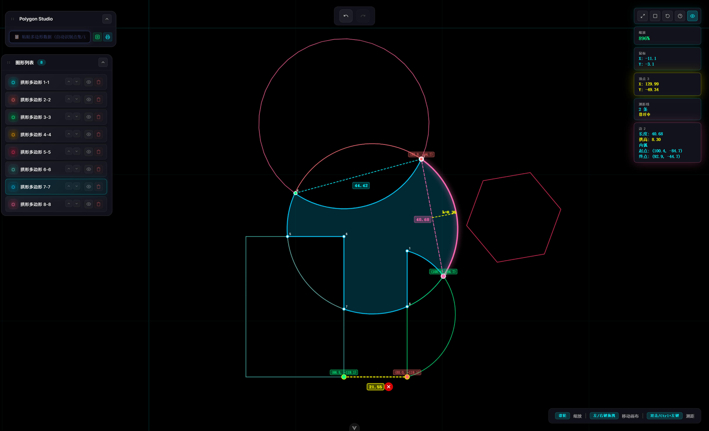

# Polygon Studio

一个功能强大的多边形绘制与可视化工具，支持多种数据格式输入、实时渲染、测距功能和动画效果。



## 功能特性

### 🎨 多边形绘制与可视化
- 支持多种数据格式输入（JSON点数组、边数据、3D点数据）
- 实时渲染多边形，支持多边形组管理
- 自动计算并显示面积、周长等几何属性
- 顶点吸附和边吸附功能

### 🖱️ 交互操作
- **滚轮**: 缩放画布
- **左/右键拖拽**: 移动画布
- **双击/Ctrl+左键**: 启动测距功能
- **点击多边形**: 选中并显示聚焦按钮

### 📐 测距功能
- 支持点到点距离测量
- 实时显示距离数值
- 测距线可删除管理

### 🎬 动画效果
- 视图切换平滑动画过渡
- 多边形显示/隐藏渐变动画
- 聚焦到图形的动画效果

### 📝 历史记录
- 支持撤销/重做操作
- 最大保存50条历史记录

## 技术栈

- **框架**: Vue 3 + TypeScript
- **构建工具**: Vite
- **样式**: 原生 CSS

## 项目结构

```
polygon-drawer/
├── src/
│   ├── components/          # Vue 组件
│   │   ├── CanvasView.vue
│   │   ├── DraggablePanel.vue
│   │   ├── GeometryList.vue
│   │   ├── GuideOverlay.vue
│   │   └── RealtimeInput.vue
│   ├── composables/         # 组合式函数
│   │   ├── geometry/
│   │   │   └── useGeometryState.ts
│   │   ├── useFocusButton.ts
│   │   ├── useHistory.ts
│   │   ├── useMeasurement.ts
│   │   └── useViewState.ts
│   ├── utils/               # 工具函数
│   │   ├── canvasRenderer.ts
│   │   ├── geometry.ts
│   │   ├── geometry3d.ts
│   │   ├── geometryGenerator.ts
│   │   └── validation.ts
│   ├── types/               # TypeScript 类型
│   │   └── index.ts
│   ├── App.vue
│   └── main.ts
├── dist/                    # 构建输出
├── index.html
├── package.json
├── tsconfig.json
└── vite.config.ts
```

## 安装与运行

### 安装依赖
```bash
npm install
```

### 开发模式
```bash
npm run dev
```

### 构建生产版本
```bash
npm run build
```

## 输入格式示例

### 点数组格式
```json
[
  {"x": 0, "y": 0},
  {"x": 100, "y": 0},
  {"x": 100, "y": 100},
  {"x": 0, "y": 100}
]
```

### 边数据格式
```json
[
  {"P1": {"X": 0, "Y": 0}, "P2": {"X": 100, "Y": 0}},
  {"P1": {"X": 100, "Y": 0}, "P2": {"X": 100, "Y": 100}},
  {"P1": {"X": 100, "Y": 100}, "P2": {"X": 0, "Y": 100}},
  {"P1": {"X": 0, "Y": 100}, "P2": {"X": 0, "Y": 0}}
]
```

### 3D点格式
```
0 0 0
100 0 0
100 100 0
0 100 0
```

### 多边形组格式
```json
[
  [{"x": 0, "y": 0}, {"x": 50, "y": 0}, {"x": 50, "y": 50}, {"x": 0, "y": 50}],
  [{"x": 100, "y": 100}, {"x": 150, "y": 100}, {"x": 150, "y": 150}, {"x": 100, "y": 150}]
]
```

## 在线演示

访问 [GitHub Pages 演示](https://bryan-zby.github.io/polygon-drawer/) 体验在线版本。

## 贡献

欢迎提交 Issue 和 Pull Request！

## 许可证

MIT License
